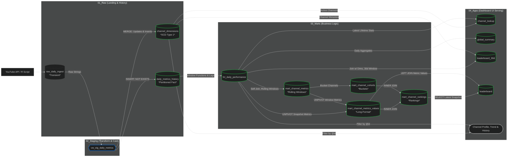
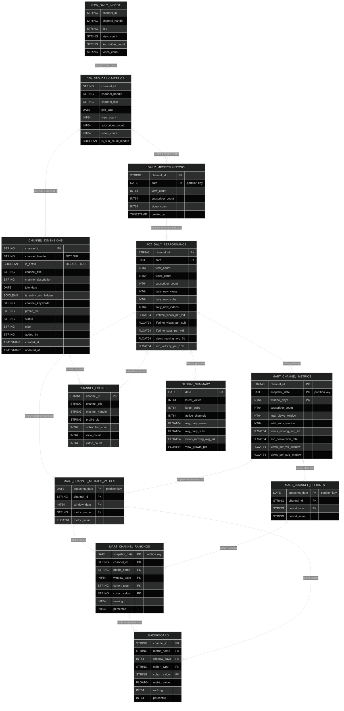
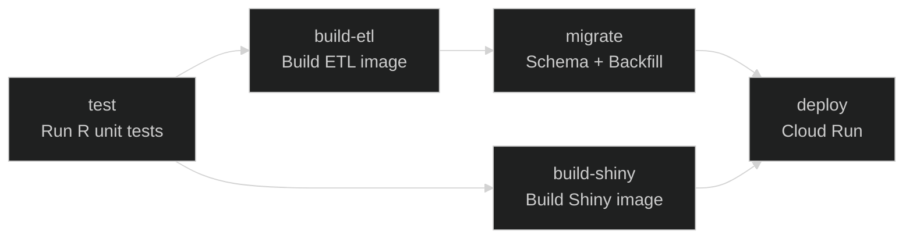

## ⛵ Sailing Channels: Data Pipeline & Analytics Dashboard

Live Dashboard: <https://sailing-creators.quantknot.com>

An automated end-to-end ETL pipeline and interactive dashboard monitoring over 1,200 curated YouTube channels within the sailing niche. This project identifies growth benchmarks and algorithmic trends using daily performance metrics.

## 🚀 The Mission

The "Sailing" niche is a unique segment of YouTube characterized by high engagement and specialized audiences. This project was built to move beyond surface-level metrics, uncovering the "Algorithmic Floor"—a power law function correlating subscriber counts to baseline views-per-video.

Key Features

-   Niche Pulse: High-level macro trends across the entire sector.
-   Creator Explorer: Deep-dive search functionality for individual channel performance.
-   Leaderboard: Dynamic ranking by 30-day view velocity and subscriber growth.
-   Growth Benchmarks: Data-driven insights into how the YouTube algorithm rewards different tiers of creators.

## 🏗 Architecture & Data Lineage

The system follows a Medallion Architecture (Raw → Staging → Marts → Apps) built entirely within Google BigQuery.

### Data Flow



### Data Model

The schema is optimized for time-series analysis of channel growth.



## 🛠 Tech Stack

| Layer | Technology | Purpose |
|-------------------|------------------------------|-----------------------|
| Language | R (tidyverse, Shiny) | ETL Orchestration & UI Development |
| Database | Google BigQuery | Scalable data warehousing & SQL transformations |
| Compute | Google Cloud Run | Serverless execution of ETL and Shiny App |
| CI/CD | GitHub Actions | Automated testing and container deployment |
| Container | Docker | Environment parity across local and production |

## 📈 Key Insight: The Algorithmic Floor

By analyzing 1,000+ channels, the Growth Benchmarks page visualizes a power law relationship between subscriber base and views-per-video. This allows creators to see if they are performing above or below the "floor" for their specific size.

## 💻 Development & Deployment

### Local Setup

1.  Clone the repo.
2.  Ensure you have a service_account.json for GCP with BigQuery access.
3.  Use the provided Dockerfiles to build the environment:

``` bash
docker build -f etl/Dockerfile.etl -t yt-etl .
docker build -f shiny/Dockerfile.shiny -t yt-shiny .
```

### CI/CD Workflow

The project uses `.github/workflows/deploy.yml`, triggered on push to `main`. It runs 5 jobs in sequence:



| Job | What it does |
|-----|-------------|
| **test** | Runs R unit tests (`tests/testthat.R`) with `testthat` |
| **build-etl** | Builds `etl/Dockerfile.etl`, pushes to Artifact Registry with commit SHA + `latest` tags |
| **build-shiny** | Builds `shiny/Dockerfile.shiny`, pushes to Artifact Registry with commit SHA + `latest` tags |
| **migrate** | Pins ETL Cloud Run Job to the new image, takes a pre-migration dataset snapshot, runs `migrate_schema.R` (DDL + apps), backfills mart tables (2024-01-01 to today), rebuilds apps, runs initial ETL to warm GCS cache |
| **deploy** | Deploys Shiny to Cloud Run (`yt-sailing-shiny`, unauthenticated), updates ETL Cloud Run Job image |
